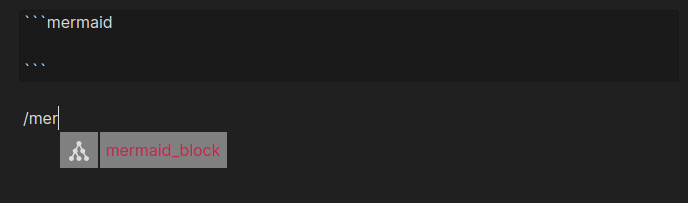

# Changelog

- Version: 0.10.1

  - **Changed**
    - Built for ES2021 instead of ES5, as Obsidian now asks of plugins ([#96](https://github.com/Reocin/obsidian-markdown-formatting-assistant-plugin/issues/96)). ES5 rewrote the plugin's classes into functions that extend Obsidian's with a call the language forbids on a native class, so the plugin would have failed to load once Obsidian's own classes are native. Nothing you see changes; the plugin file is 19 KB smaller.

- Version: 0.10.0

  - **Added**
    - A setting for where the side panel's buttons sit: left, centre or right. The rows of buttons, the table picker, the colour swatches and the links under each section all follow it, and an open panel changes straight away. Centred stays the default, so nothing moves unless you ask. Requested in [#94](https://github.com/Reocin/obsidian-markdown-formatting-assistant-plugin/issues/94).
  - **Fixed**
    - The recent and saved colours in the side panel hugged its right edge since 0.6.0. A rule meant for the settings tab, where the swatches sit beside the colour picker, applied to the panel as well. They follow the panel's alignment now, and so do their titles — with the default, centred like the rest of the panel.
    - The HTML checkbox in the Colors section promised `{selected text}`. Since 0.9.0 it applies only with nothing selected, and then writes an empty tag, so that is what its label shows now.

- Version: 0.9.1

  - **Fixed**
    - The links in the side panel for reporting a missing tag or function, and the one to the color picker's help, led to a copy of the repository with its issue tracker turned off. They lead here now, as does the bug report link at the top of this page.

- Version: 0.9.0

  - **Added**
    - Forty more LaTeX operators: relations, set and logic symbols, arrows, `\lim`, `\nabla`, `\binom`, `\overline`, blackboard bold. Four are on the panel; the rest are in the `ALT+Q` window, where they can be searched by name rather than hunted for among a wall of buttons.
    - A **page break** for PDF export, and **text alignment** — left, center, right and justify. Both are html, because Obsidian has no markdown for either.
    - The side panel can be used from the keyboard. Tab reaches every button, Enter and Space press it, and the focused one is visibly focused. Every button has a name, so a screen reader can announce it — most of them hold a drawing and no text, and until now there was nothing to announce at all. The names show as tooltips on hover for everyone else.
  - **Fixed**
    - Selecting text and clicking a color replaced the text with the color code. It is wrapped so it takes the color now, in one click and with no options to tick first. Asking for a background gives a ``, since a `` tag can only color text.
    - Ticking both the style attribute and the html option produced markup that was never valid.
    - Quotes and lists are applied to whole lines. Starting a selection mid-word used to put the marker there, splitting the line. A bullet added inside a quote goes after the `>`, and a blank line in the middle no longer stops the list being turned off again.
    - `∑`, `∫`, `√` and `·` appeared as `&sum;`, `&int;`, `&radic;` and `&middot;` since 0.7.0.
    - A setting typed in the last fraction of a second before quitting Obsidian is no longer lost.
    - Clicking the words next to the color checkboxes toggles them.
  - **Changed**
    - The elements the plugin puts in the document carry prefixed ids. `colorInput` and `lastSavedColorsDiv` were generic enough to collide with another plugin or a theme snippet, and the panel looks several of them up by id — so a collision would have found the wrong element rather than failed.
    - No fixed styling is written from JavaScript anywhere, including the last icon that set its own size.

- Version: 0.8.1

  - **Fixed**
    - Removing a toolbar button could remove a different one. Every row stayed clickable while the change was being saved, and each of them remembered the position it was drawn at, so a second click acted on whatever had moved into that slot.
    - Dropping anything at all onto a row in the toolbar settings — a text selection, a file from outside Obsidian — moved the first button to that position.
    - Reordering saved colors or side panel sections swapped the two entries instead of moving one. Dragging the first onto the last sent the last one to the front and left everything between them alone.
    - A toolbar button took the cursor out of the note. Typing went nowhere until you clicked back into the text, and pressing Space or Enter pressed the button again, undoing what it had just done.
    - A note moved to its own window kept its toolbar after the plugin was disabled, until that window was closed.
    - A toolbar button whose plugin had been disabled stayed missing after that plugin was enabled again, until Obsidian restarted.
  - **Added**
    - A `LICENSE` file. The plugin has declared MIT since its first commit in 2021 but never carried the licence text.
  - **Changed**
    - Nothing is written to the developer console on load.

- Version: 0.8.0

  - **Added**
    - A toolbar above the note, off until you turn it on. A button is an Obsidian command, so **any** command in your vault can go on it — Obsidian's own, this plugin's and other plugins' alike. Add them by searching, drag the rows to reorder, and put the row on the left, in the middle or on the right.
    - The plugin's commands now carry the panel's icons, which Obsidian shows wherever it lists them.
  - **Notes**
    - The toolbar is desktop only. On mobile Obsidian already puts one above the keyboard.
    - It appears only while you are editing, since every button writes to the note, and it wraps rather than scrolls, so a narrow pane costs a row of height instead of hiding buttons.
    - Obsidian publishes no place to put such a bar, so it is inserted into the editor's own container. That is the first thing to check if a future Obsidian release moves it.

- Version: 0.7.0

  - **Added**
    - Every Text Edit action and every callout is now an Obsidian command, so you can bind a hotkey to any of them under `Settings → Hotkeys`. Nothing is bound out of the box beyond the existing `ALT+Q` and `ALT+C`.
    - The side panel has a command of its own, so it no longer needs the ribbon icon to open.
  - **Fixed**
    - Right-clicking a color removes it again, in both the recent and the saved row. The branch that did the removing could never run: only a left click was ever bound, while the README described right-click as the way to delete.
    - A section that opens expanded now shows an arrow pointing the right way. It used to be drawn pointing down regardless, and only agreed with the section after two clicks.
    - The four label colors in the `ALT+Q` window follow the theme. They were fixed values picked against a dark background, and the green was close to unreadable on a light one.
  - **Changed**
    - No styling is assigned from JavaScript any more and no markup is built from strings - 121 inline styles and every `innerHTML` are gone. Obsidian's plugin guidelines name both, and a submission to the community catalogue is reviewed against them.
  - **Development**
    - 120 tests. The new ones fail the build on a mistyped class name, a stylesheet rule nothing uses, and any new inline style or `innerHTML`.

- Version: 0.6.0

  - **Added**
    - A Tables section: pick a size up to 6 by 6 and an alignment, and the table is inserted with its columns lined up in the source.
    - Callout headings are written into the note in your interface language, while the keyword inside `[!note]` stays English. Can be turned off in the settings.
  - **Fixed**
    - Inserting a table or a callout in the middle of a line no longer glues the rest of that line onto the block. Whatever followed the cursor moves below it.
    - Wrapping a selection that spans several paragraphs in a callout keeps all of it inside: the quote marker is repeated on every line, instead of only the first one.
  - **Changed**
    - The plugin no longer reaches into CodeMirror 5 internals. Everything goes through Obsidian's public Editor API, which is what makes it safe on current versions.
    - The plugin's styles are scoped to its own panel and settings tab. They used to override Obsidian's button classes globally and restyled the file explorer and the search header along with them.
    - Removed the `Trigger Char` setting. It was left over from the command language that the `ALT+Q` window replaced, and nothing had read it since.
  - **Development**
    - A test suite that runs on Node's native TypeScript support, with no test framework as a dependency: 93 tests over the text and cursor arithmetic and the consistency of the twelve translation files.

- Version: 0.5.0

  - **Added**
    - The interface is translated into 12 languages and follows Obsidian's own language setting by default.
    - New HTML tags: `<i>`, `<b>`, `<em>`, `<strong>`, `<mark>`, ``, ``, `<kbd>`, `<pre>`, `
`, `<dfn>`, `<abbr>`, `
`.
    - New Latex functions: `\sum`, `\int`, `\sqrt`, `\cdot`, `\hat`, `\vec`.
    - The suggestion windows now match the English command name as well as the translated label.
  - **Fixed**
    - Buttons no longer take the "text is selected" path when nothing is selected - that branch had been unreachable in every formatter.
    - Code block and mermaid insertion put the cursor on the right line, and wrapping a selection in a mermaid block no longer tears the fence apart.
    - Reordering the side panel sections by drag and drop works again.
    - Converting to a quote or a list keeps the indentation, so nested lists survive the toggle.
    - The `` snippet no longer emits a closing tag, which Obsidian rendered as literal text.
    - Dropping a saved color next to the swatches no longer corrupts the saved color list.
    - Opening the settings tab no longer reverses the order of the saved colors.
    - The settings tab renders correctly alongside plugins that read it programmatically, such as Settings Search.
    - The warning about a malformed saved color now names the right line.
  - **Changed**
    - The side panel adapts to the width of its pane instead of being fixed at 300px, on desktop and mobile alike.
    - The released `main.js` no longer ships an inline source map and is about 20 times smaller.
    - Removed the `Glyph` callout: it was a duplicate of `Quote` that produced a callout type Obsidian does not know.
    - Removed the duplicate `pi` entry from the Latex section - the one in the Greek Letters section remains.
    - Debug output no longer goes to the developer console.

- Version: 0.4.1
  - Added Callouts-Support
- Version: 0.4.0
  - Updated the plugin to the new Obsidian API 0.15.x
  - Replace command language with a suggestion window triggered by a hotkey
  - Fixed the wrong courser position after use of the header buttons/command (h1,h2, ...)
- Version: 0.3.2
  - Additional options for the color picker
  - New Highlight Button in the Text Edit section and command line
- Version 0.3.1
  - Changeable order of the sections
  - Expandable sections
  - Corrected the latex `\$\$` and `\$\$\$\$` buttons as they were switched
- Version 0.3.0
  - added a Latex and Greek Letters section
- Version 0.2.2
  - added /mermaid snipplet to generate mermaid code block - allows drawing diagrams 
- Version 0.2.1
  ⁻ Some Bug Fixes
  - No input preview mode
  - Highlighting of the html buttons when hover
  - Replace selection when insert colors.
  - Saved Colors can be added and edited in the settings.
  - New HTML Tags `

` and `

`
- Vesion 0.2.0
  - Added support for HTML snippets in command language and in side pane.
  - Added a color picker
- Vesion 0.1.2
  - Inital plugin
