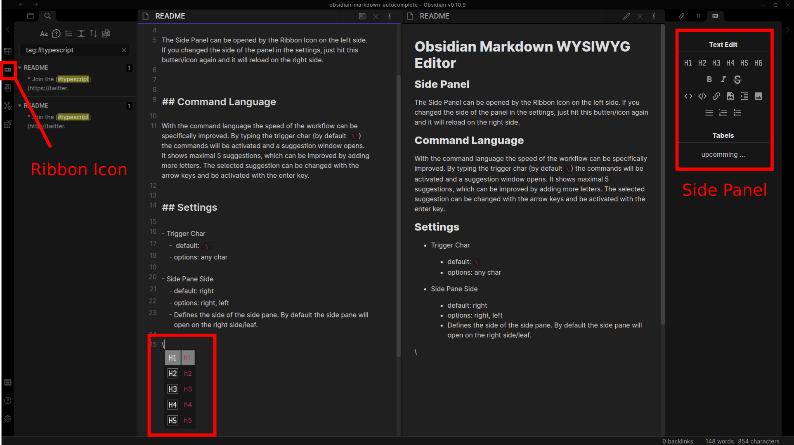
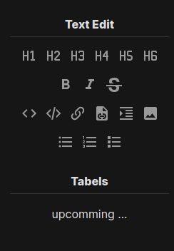
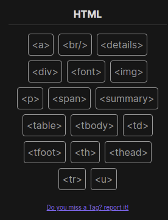
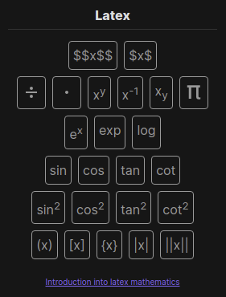
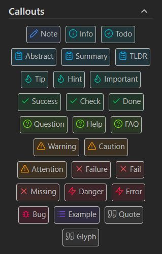
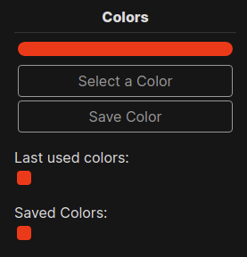

# Obsidian Markdown Formatting Assistant

> This Plugin provides easy to use snippets for Markdown, HTML and Latex and a color picker which shows the history of last used colors. Furthermore, it is possible to save any color you want.
> Version 0.9.1

> If you find a Bug or have a feature request: https://github.com/Reocin/obsidian-markdown-formatting-assistant-plugin/issues

Written by [Reocin](https://github.com/Reocin), who handed maintenance over in 2026; versions from 0.5.0 on are maintained by Mark Karte and Claude, in this same repository. It is MIT licensed — the plugin declared MIT in its `package.json` from its first commit but never shipped the licence text, so [LICENSE](LICENSE) states it explicitly and credits both.



## Languages

The interface is available in 12 languages: English, Беларуская, Deutsch, Español, Français, Italiano, 日本語, 한국어, Português, Русский, Українська and 简体中文.

By default the plugin follows the language Obsidian itself is set to. You can pick a specific one under `Settings → Markdown Formatting Assistant → Language`.

Only what you read is translated. The callout keyword inside `> [!note]` stays English, because that is what Obsidian matches on. The suggestion windows search both the translated label and the original English name, so `warning` and `Предупреждение` both find the same button.

Translations other than English and Russian have not been reviewed by native speakers yet - corrections are very welcome. A language lives in a single file under `src/locales/`, and adding a new one means writing that file and adding one line to `src/locales/index.ts`.

## Side Panel

The Side Panel can be opened by the Ribbon Icon on the left side. If you changed the side (left or right) of the panel in the settings, just hit this butten/icon again and it will reload on the right side.

The panel follows the width of its pane, so the button grid reflows when you drag the pane wider or narrower.

### Order and expansion of the Sections

It is possible to change the order of the sections according to the personal wishes. Furthermore it is possible to expand and shrink every section to keep the overview.


### Text Edit Section

Headings, bold, italic, strikethrough, highlight, quotes, the three list kinds, links, images, code and mermaid blocks.

Quotes and lists work on whole lines, so it does not matter where in the line you started the selection or left the cursor. A selection that covers part of several lines converts all of them; blank lines in between are left alone, and a bullet added inside a quote goes after the `>` rather than in front of it. Pressing the same button again takes the markers off.



### Tables Section

Pick a size from the grid - up to 6 rows by 6 columns, counting the header - and the table is inserted with its columns already lined up in the source. The alignment buttons below the grid set the delimiter row to none, left, centre or right, and the choice is remembered for the next table.

A table dropped in the middle of a line moves onto a line of its own, and whatever followed the cursor is pushed below it rather than glued onto the last row.

### HTML Section

`<a>` `<abbr>` `<b>` `<br/>` `<center>` `<details>` `<dfn>` `<div>` `<em>` `<font>` `<hr/>` `<i>` `` `<kbd>` `<mark>` `<p>` `<pre>` `<span>` `<strong>` `<sub>` `<summary>` `<sup>` `<table>` `<tbody>` `<td>` `<tfoot>` `<th>` `<thead>` `<tr>` `<u>`

Two things that are not tags but are written as html because Obsidian has no markdown for them: a **page break** for PDF export, and **text alignment** — left, center, right and justify.



### Latex Section

> Latex Functions only work if they are in a latex equation section like $...$ or $$...$$.

Around seventy operators are available, but only a third of them are on the panel. The rest — relations, set and logic symbols, arrows, `\lim`, `\nabla`, `\binom`, `\overline` and so on — are in the `ALT+Q` window, where they can be searched for by name. A panel showing all of them would be a wall of symbols to read through every time.



### Greek Letters Section

> Greek Letters only work if they are in a latex equation section like $...$ or $$...$$.


### Callouts Section

26 callout types, each inserting the corresponding Obsidian callout block.

The heading is written in your interface language, so a note reads `> [!note] Информация` rather than showing Obsidian's English default. The keyword inside the brackets always stays English - that is what Obsidian matches on to pick the icon and the colour. Turn the setting off if you would rather type the heading yourself.

Selected text becomes the body of the callout, and a selection spanning several paragraphs stays inside it: the quote marker is repeated on every line.



## Suggestion Window with Shortcut

This plugin does have a default shortcut `ALT+Q` which opens a Suggestion Window with all commands of this plugin (except colors, tables and callouts). Once you get used to it, you want never miss it again. Furthermore, this way there is no need to ever leave your keyboard!

With the default shortcut `ALT-C` a Suggestion Window for Callouts is opened with the same functionality like the common Suggestion Window.

### How it works
Just press the shortcut/hotkey `ALT+Q` on any place. It doesn't matter if you are on a specific position or selected some text you want to change. Then enter the name of the command you want to apply. After a few letters your wished command should be suggested in the top 5.


### How to change the shortcut/hotkey

The shortcut/hotkey `ALT+Q` was selected becaus it can be  comfortable reached with just one hand, but you can change it to what ever you want.


## Hotkeys for individual commands

Every Text Edit action and every callout is registered as an Obsidian command, so you can bind a key to any of them under `Settings → Hotkeys`. Search for the plugin's name to see the whole list. Nothing is bound out of the box apart from `ALT+Q` and `ALT+C`, so no existing shortcut of yours is taken over.

That covers headings, bold, italic, underline, strikethrough, highlight, inline code, code and mermaid blocks, links, images, quotes, the three list kinds, and the 26 callouts. `Cmd+1` for `H1` and `Cmd+2` for `H2` is a common arrangement.

The side panel itself has a command too, so it can be opened without reaching for the ribbon icon.

The HTML, LaTeX and Greek sections are deliberately left out. Between them they hold another 93 entries, and a hotkey list is not a useful place to look for `\alpha` — the `ALT+Q` window is, and it searches all of them.

## Toolbar above the note

A row of buttons at the top of the editor, so the side panel can stay closed. It is off until you turn it on under `Settings → Markdown Formatting Assistant → Toolbar above the note`, because it takes a strip of room from the note.

A button is an Obsidian command and nothing else. That is what makes the row worth assembling: **any** command in your vault can go on it — Obsidian's own, this plugin's, and other plugins' alike. Add them with the search field, drag the rows to put them in the order you work in, and remove the ones you never press.

It starts with everyday formatting: headings, bold, italic, strikethrough, highlight, inline code, quote, the three list kinds and a link. Nothing about that set is special; clear it out and build your own.

The buttons can sit at the left of the row, in the middle, or at the right — whichever suits where your eyes already are.

The bar appears only while you are editing, since every button writes to the note, and it wraps rather than scrolls, so a narrow pane costs a row of height instead of hiding half the buttons.

Desktop only. On mobile Obsidian already puts a toolbar above the keyboard, and a second one would only be in the way.

> The toolbar is inserted into the editor's own container, because Obsidian publishes no place to put one. That is the first thing to check if a future Obsidian release moves it or loses it.
## Color Picker

### Select a color

The color picker provides an easy and fast workflow to work with colors. If you pick a color with the `Select a Color` button and leave the window (by clicking outside the color picker), the selected color will be inserted at the current courser position. In addition, it will be copied to the clipboard.

### Color History

Furthermore, the color picker saves the history of the last 10 used colors.

### Saved Colors

To Save the current color even if obsidian will be closed, just click the `Save Color` button.

### Sort saved Colors

All saved colors can be sorted via drop a catch.

### Delete a Color

Right-click a swatch to remove it, in either the recent or the saved row. Saved colors can also be removed in the settings by clicking a swatch there.

### Coloring selected text

Select some text and click a color — recent, saved, or freshly picked — and the selection is wrapped so it takes that color. One click, no options to tick first.

Ticking `background-color` gives you a background instead, since a `<font>` tag can only set the color of the text.

### Additional Formats

With **nothing** selected, the options below decide what the click writes at the cursor. They describe a piece of code to paste into a tag you are already writing, which is why they do not apply when there is a selection — there is only one thing "color this text" can mean.

#### Options

- Add "color: {your color}"
  - ex. `color: #ffffff`
- Add "background-color: {your color}
  - ex. `background-color: #ffffff`
- Add tag: "style={your color}
  - This option is only helpful, if you also select one of both of the other options like:
  - ex. `style="background-color: #ff0000"`
- Add HTML: "`<font color={your color}>{selected text}</font>`"
  - Useful for quickly coloring text.
  - ex. `<font color="#ffffff">Hello World</font>`



## Settings

- Language

  - default: same as Obsidian
  - options: any of the 12 supported languages
  - Language of the plugin interface.

- Side Pane Side

  - default: right
  - options: right, left
  - Defines the side of the side pane. By default the side pane will open on the right side/leaf.

- Section toggles

  - default: all enabled
  - Every section of the side panel can be turned off individually. Requires a restart.

- Write callout headings

  - default: on
  - Inserts the callout name as its heading, so the note shows it in your language. The keyword inside `[!note]` stays English either way.

- Toolbar above the note

  - default: off
  - Shows a row of buttons at the top of the editor, and lets you choose which commands appear on it, in what order, and whether they sit left, centre or right. Desktop only.

- Saved Colors
  - default: one entry
  - Shows the saved colors as swatches next to a color picker. Pick a color to add it, click a swatch to remove it. The order is kept and is the order the panel shows them in.

## Development

```
npm install
npm run build
```

The build lands in `build/` and contains everything Obsidian needs: `main.js`, `manifest.json` and `styles.css`. Copy that folder into `<vault>/.obsidian/plugins/<plugin-id>/` to try it out.

```
npm test
npm run typecheck
```

The tests run on Node's own TypeScript support, so there is no test framework to install - Node 22.6 or newer is enough. They cover the text and cursor arithmetic (`src/textPlacement.ts`) and the consistency of the translation files: that every locale covers every English key, carries no key English has retired, keeps the same `{placeholders}`, and leaves the callout keywords in ASCII.

Run `npm run typecheck` as well as the build. Rollup reports a clean build for code that `tsc` rejects, so a green build on its own means very little here.

## Credits

Originally written by [Reocin](https://github.com/Reocin). Maintained since version 0.5.0 by Mark Karte and Claude.

## Changelog

- Version: 0.9.1

  - **Fixed**
    - The links in the side panel for reporting a missing tag or function, and the one to the color picker's help, led to a copy of the repository with its issue tracker turned off. They lead here now, as does the bug report link at the top of this page.

- Version: 0.9.0

  - **Added**
    - Forty more LaTeX operators: relations, set and logic symbols, arrows, `\lim`, `\nabla`, `\binom`, `\overline`, blackboard bold. Four are on the panel; the rest are in the `ALT+Q` window, where they can be searched by name rather than hunted for among a wall of buttons.
    - A **page break** for PDF export, and **text alignment** — left, center, right and justify. Both are html, because Obsidian has no markdown for either.
    - The side panel can be used from the keyboard. Tab reaches every button, Enter and Space press it, and the focused one is visibly focused. Every button has a name, so a screen reader can announce it — most of them hold a drawing and no text, and until now there was nothing to announce at all. The names show as tooltips on hover for everyone else.
  - **Fixed**
    - Selecting text and clicking a color replaced the text with the color code. It is wrapped so it takes the color now, in one click and with no options to tick first. Asking for a background gives a `<span>`, since a `<font>` tag can only color text.
    - Ticking both the style attribute and the html option produced markup that was never valid.
    - Quotes and lists are applied to whole lines. Starting a selection mid-word used to put the marker there, splitting the line. A bullet added inside a quote goes after the `>`, and a blank line in the middle no longer stops the list being turned off again.
    - `∑`, `∫`, `√` and `·` appeared as `&sum;`, `&int;`, `&radic;` and `&middot;` since 0.7.0.
    - A setting typed in the last fraction of a second before quitting Obsidian is no longer lost.
    - Clicking the words next to the color checkboxes toggles them.
  - **Changed**
    - The elements the plugin puts in the document carry prefixed ids. `colorInput` and `lastSavedColorsDiv` were generic enough to collide with another plugin or a theme snippet, and the panel looks several of them up by id — so a collision would have found the wrong element rather than failed.
    - No fixed styling is written from JavaScript anywhere, including the last icon that set its own size.

- Version: 0.8.1

  - **Fixed**
    - Removing a toolbar button could remove a different one. Every row stayed clickable while the change was being saved, and each of them remembered the position it was drawn at, so a second click acted on whatever had moved into that slot.
    - Dropping anything at all onto a row in the toolbar settings — a text selection, a file from outside Obsidian — moved the first button to that position.
    - Reordering saved colors or side panel sections swapped the two entries instead of moving one. Dragging the first onto the last sent the last one to the front and left everything between them alone.
    - A toolbar button took the cursor out of the note. Typing went nowhere until you clicked back into the text, and pressing Space or Enter pressed the button again, undoing what it had just done.
    - A note moved to its own window kept its toolbar after the plugin was disabled, until that window was closed.
    - A toolbar button whose plugin had been disabled stayed missing after that plugin was enabled again, until Obsidian restarted.
  - **Added**
    - A `LICENSE` file. The plugin has declared MIT since its first commit in 2021 but never carried the licence text.
  - **Changed**
    - Nothing is written to the developer console on load.

- Version: 0.8.0

  - **Added**
    - A toolbar above the note, off until you turn it on. A button is an Obsidian command, so **any** command in your vault can go on it — Obsidian's own, this plugin's and other plugins' alike. Add them by searching, drag the rows to reorder, and put the row on the left, in the middle or on the right.
    - The plugin's commands now carry the panel's icons, which Obsidian shows wherever it lists them.
  - **Notes**
    - The toolbar is desktop only. On mobile Obsidian already puts one above the keyboard.
    - It appears only while you are editing, since every button writes to the note, and it wraps rather than scrolls, so a narrow pane costs a row of height instead of hiding buttons.
    - Obsidian publishes no place to put such a bar, so it is inserted into the editor's own container. That is the first thing to check if a future Obsidian release moves it.

- Version: 0.7.0

  - **Added**
    - Every Text Edit action and every callout is now an Obsidian command, so you can bind a hotkey to any of them under `Settings → Hotkeys`. Nothing is bound out of the box beyond the existing `ALT+Q` and `ALT+C`.
    - The side panel has a command of its own, so it no longer needs the ribbon icon to open.
  - **Fixed**
    - Right-clicking a color removes it again, in both the recent and the saved row. The branch that did the removing could never run: only a left click was ever bound, while the README described right-click as the way to delete.
    - A section that opens expanded now shows an arrow pointing the right way. It used to be drawn pointing down regardless, and only agreed with the section after two clicks.
    - The four label colors in the `ALT+Q` window follow the theme. They were fixed values picked against a dark background, and the green was close to unreadable on a light one.
  - **Changed**
    - No styling is assigned from JavaScript any more and no markup is built from strings - 121 inline styles and every `innerHTML` are gone. Obsidian's plugin guidelines name both, and a submission to the community catalogue is reviewed against them.
  - **Development**
    - 120 tests. The new ones fail the build on a mistyped class name, a stylesheet rule nothing uses, and any new inline style or `innerHTML`.

- Version: 0.6.0

  - **Added**
    - A Tables section: pick a size up to 6 by 6 and an alignment, and the table is inserted with its columns lined up in the source.
    - Callout headings are written into the note in your interface language, while the keyword inside `[!note]` stays English. Can be turned off in the settings.
  - **Fixed**
    - Inserting a table or a callout in the middle of a line no longer glues the rest of that line onto the block. Whatever followed the cursor moves below it.
    - Wrapping a selection that spans several paragraphs in a callout keeps all of it inside: the quote marker is repeated on every line, instead of only the first one.
  - **Changed**
    - The plugin no longer reaches into CodeMirror 5 internals. Everything goes through Obsidian's public Editor API, which is what makes it safe on current versions.
    - The plugin's styles are scoped to its own panel and settings tab. They used to override Obsidian's button classes globally and restyled the file explorer and the search header along with them.
    - Removed the `Trigger Char` setting. It was left over from the command language that the `ALT+Q` window replaced, and nothing had read it since.
  - **Development**
    - A test suite that runs on Node's native TypeScript support, with no test framework as a dependency: 93 tests over the text and cursor arithmetic and the consistency of the twelve translation files.

- Version: 0.5.0

  - **Added**
    - The interface is translated into 12 languages and follows Obsidian's own language setting by default.
    - New HTML tags: `<i>`, `<b>`, `<em>`, `<strong>`, `<mark>`, `<sup>`, `<sub>`, `<kbd>`, `<pre>`, `<center>`, `<dfn>`, `<abbr>`, `<hr/>`.
    - New Latex functions: `\sum`, `\int`, `\sqrt`, `\cdot`, `\hat`, `\vec`.
    - The suggestion windows now match the English command name as well as the translated label.
  - **Fixed**
    - Buttons no longer take the "text is selected" path when nothing is selected - that branch had been unreachable in every formatter.
    - Code block and mermaid insertion put the cursor on the right line, and wrapping a selection in a mermaid block no longer tears the fence apart.
    - Reordering the side panel sections by drag and drop works again.
    - Converting to a quote or a list keeps the indentation, so nested lists survive the toggle.
    - The `` snippet no longer emits a closing tag, which Obsidian rendered as literal text.
    - Dropping a saved color next to the swatches no longer corrupts the saved color list.
    - Opening the settings tab no longer reverses the order of the saved colors.
    - The settings tab renders correctly alongside plugins that read it programmatically, such as Settings Search.
    - The warning about a malformed saved color now names the right line.
  - **Changed**
    - The side panel adapts to the width of its pane instead of being fixed at 300px, on desktop and mobile alike.
    - The released `main.js` no longer ships an inline source map and is about 20 times smaller.
    - Removed the `Glyph` callout: it was a duplicate of `Quote` that produced a callout type Obsidian does not know.
    - Removed the duplicate `pi` entry from the Latex section - the one in the Greek Letters section remains.
    - Debug output no longer goes to the developer console.

- Version: 0.4.1
  - Added Callouts-Support
- Version: 0.4.0
  - Updated the plugin to the new Obsidian API 0.15.x
  - Replace command language with a suggestion window triggered by a hotkey
  - Fixed the wrong courser position after use of the header buttons/command (h1,h2, ...)
- Version: 0.3.2
  - Additional options for the color picker
  - New Highlight Button in the Text Edit section and command line
- Version 0.3.1
  - Changeable order of the sections
  - Expandable sections
  - Corrected the latex `\$\$` and `\$\$\$\$` buttons as they were switched
- Version 0.3.0
  - added a Latex and Greek Letters section
- Version 0.2.2
  - added /mermaid snipplet to generate mermaid code block - allows drawing diagrams 
- Version 0.2.1
  ⁻ Some Bug Fixes
  - No input preview mode
  - Highlighting of the html buttons when hover
  - Replace selection when insert colors.
  - Saved Colors can be added and edited in the settings.
  - New HTML Tags `<details></details>` and `<summary></summary>`
- Vesion 0.2.0
  - Added support for HTML snippets in command language and in side pane.
  - Added a color picker
- Vesion 0.1.2
  - Inital plugin
