<div align="center">


# Markdown Formatting Assistant

**Formatting one click or one keystroke away**<br>
a side panel, a search window and a toolbar of your own — for Markdown, HTML, LaTeX, tables and callouts

<a href="README.md"></a>
<a href="README.be.md"></a>
<a href="README.de.md"></a>
<a href="README.es.md"></a>
<a href="README.fr.md"></a>
<a href="README.it.md"></a>
<a href="README.ja.md"></a>
<a href="README.ko.md"></a>
<a href="README.pt.md"></a>
<a href="README.ru.md"></a>
<a href="README.uk.md"></a>
<a href="README.zh.md"></a>

<a href="https://github.com/Reocin/obsidian-markdown-formatting-assistant-plugin/releases/latest"></a>
<a href="https://community.obsidian.md/plugins/obsidian-markdown-formatting-assistant-plugin"></a>

<a href="LICENSE"></a>
<a href="https://github.com/Reocin/obsidian-markdown-formatting-assistant-plugin/stargazers"></a>

<br>

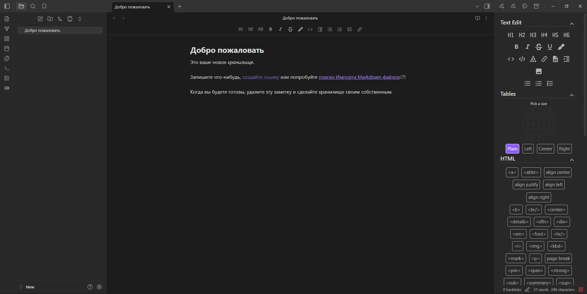

<br>

<a href="https://community.obsidian.md/plugins/obsidian-markdown-formatting-assistant-plugin"></a>

<sub>Obsidian 1.0 or newer · desktop and mobile · 12 interface languages · free and open source</sub>

</div>

- **Side panel** with seven sections you can reorder, fold and switch off, its buttons lined up left, centre or right.
- **`Alt+Q`** searches about 160 snippets by name, in your language or in English. **`Alt+C`** does the same for the 26 callouts.
- **Hotkeys** for every Text Edit action and every callout, bound wherever you like.
- **Toolbar above the note**, off by default: any command in your vault, in the order you choose.
- **Colour picker** that colours selected text in one click, and remembers recent and saved colours.
- **12 languages**, following Obsidian's own by default.
- **Works from the keyboard** and with screen readers.

Written by [Reocin](https://github.com/Reocin), who handed maintenance over in 2026; versions from 0.5.0 on are maintained by Mark Karte and Claude, in this same repository.

## Installation

In Obsidian open `Settings → Community plugins`, choose **Browse**, search for *Markdown Formatting Assistant*, then **Install** and **Enable**.

To install by hand, download `main.js`, `manifest.json` and `styles.css` from the [latest release](https://github.com/Reocin/obsidian-markdown-formatting-assistant-plugin/releases/latest) into `<vault>/.obsidian/plugins/obsidian-markdown-formatting-assistant-plugin/` and enable the plugin.

## Side Panel

Open it with the ribbon icon on the left, or with the command *Open Markdown Formatting Assistant*, which can be given a hotkey like any other. It opens in the right sidebar; `Side Pane Side` in the settings moves it to the left — press the ribbon icon again after changing it.

The panel follows the width of its pane, so the button grid reflows when you drag the pane wider or narrower. It works on mobile too.

The buttons are centred unless you choose otherwise: `Panel button alignment` in the settings lines them up on the left or the right instead — the swatches, the table picker and the links under each section with them. An open panel changes straight away.

With text selected, formatting buttons — bold, a tag, a callout and the like — wrap it rather than replace it. With nothing selected, they insert at the cursor.

### Arranging the sections

Drag a section by its header to move it, and click the arrow to fold it. The order and the folding are remembered. A section you never use can be switched off in the settings.

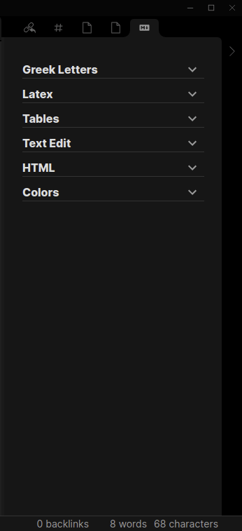

### Text Edit

Headings H1 to H6, bold, italic, underline, strikethrough, highlight, inline code, code and mermaid blocks, links, internal links, images, quotes, and bulleted, numbered and task lists. Pressing a heading button on a line that already has that heading removes it.

Quotes and lists work on whole lines, so it does not matter where in the line you started the selection or left the cursor. A selection that covers part of several lines converts all of them; blank lines in between are left alone, and a bullet added inside a quote goes after the `>` rather than in front of it. Pressing the same button again takes the markers off.

### Tables

Pick a size from the grid — up to 6 rows by 6 columns, counting the header — and the table is inserted with its columns already lined up in the source. The alignment buttons below the grid set the delimiter row to none, left, centre or right, and the choice is remembered for the next table.

A table dropped in the middle of a line moves onto a line of its own, and whatever followed the cursor is pushed below it rather than glued onto the last row.

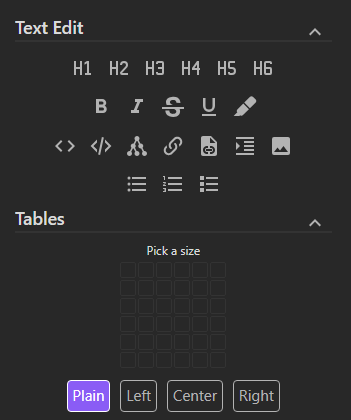

### HTML

`<a>` `<abbr>` `<b>` `<br/>` `<center>` `<details>` `<dfn>` `<div>` `<em>` `<font>` `<hr/>` `<i>` `` `<kbd>` `<mark>` `<p>` `<pre>` `<span>` `<strong>` `<sub>` `<summary>` `<sup>` `<table>` `<tbody>` `<td>` `<tfoot>` `<th>` `<thead>` `<tr>` `<u>`

Two things that are not tags but are written as HTML because Obsidian has no Markdown for them: a **page break** for PDF export, and **text alignment** — left, center, right and justify.

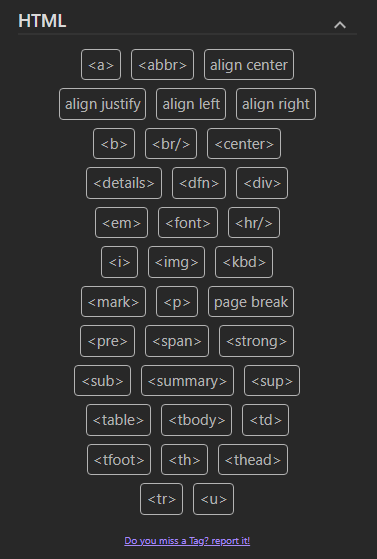

### Latex

> LaTeX only works inside an equation, `$...$` or `$$...$$`.

69 operators. The 33 on the panel are the everyday ones: fractions, powers and indices, `\sqrt`, `\sum`, `\int`, `\prod`, `\lim`, `\partial`, `\infty`, trigonometric functions and brackets. The other 36 — relations, set and logic symbols, arrows, `\nabla`, `\binom`, `\overline`, blackboard bold and so on — are only in the `Alt+Q` window, where they can be found by name. A panel showing all of them would be a wall of symbols to read through every time.

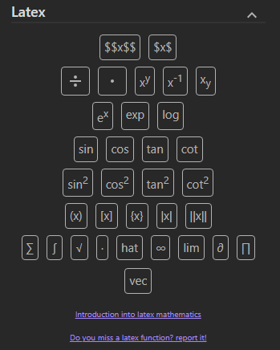

### Greek Letters

> Like LaTeX, Greek letters only work inside an equation.

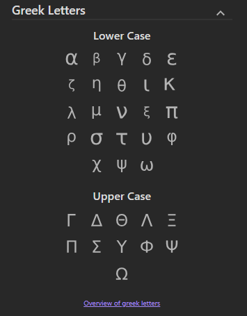

### Callouts

26 callout types, each inserting the corresponding Obsidian callout block.

The heading is written in your interface language, so a note reads `> [!note] Заметка` rather than showing Obsidian's English default. The keyword inside the brackets always stays English — that is what Obsidian matches on to pick the icon and the colour. Turn `Write callout headings` off if you would rather type the heading yourself.

Selected text becomes the body of the callout, and a selection spanning several paragraphs stays inside it: the quote marker is repeated on every line.

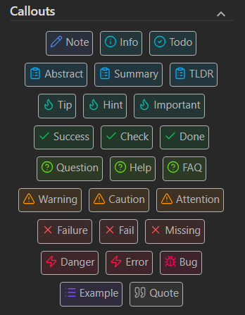

## Search windows

`Alt+Q` opens a search over every snippet in the Text Edit, HTML, LaTeX and Greek sections — about 160 of them. Type a few letters of the name and press Enter; it works wherever the cursor is and whether or not text is selected, so your hands never leave the keyboard. Names match in your interface language and in English alike, so `warning` and `Предупреждение` find the same thing.

`Alt+C` is the same window for callouts.

Tables and colours are on the panel only.

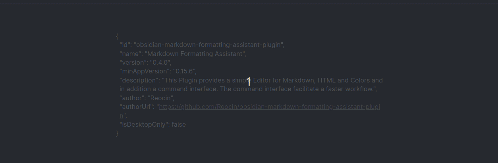

Both keys can be changed under `Settings → Hotkeys`: search for *Open Command Selector* or *Open Callouts Selector*.

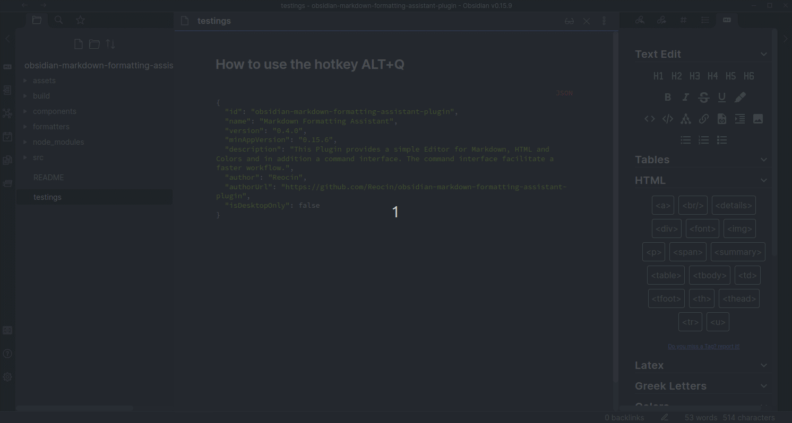

## Hotkeys for individual commands

Every Text Edit action and every callout is registered as an Obsidian command, so you can bind a key to any of them under `Settings → Hotkeys`. Search for the plugin's name to see the whole list. Nothing is bound out of the box apart from `Alt+Q` and `Alt+C`, so no existing shortcut of yours is taken over.

That covers headings, bold, italic, underline, strikethrough, highlight, inline code, code and mermaid blocks, links, images, quotes, the three list kinds, and the 26 callouts. `Cmd+1` for `H1` and `Cmd+2` for `H2` is a common arrangement.

The side panel itself has a command too, so it can be opened without reaching for the ribbon icon.

The HTML, LaTeX and Greek sections are deliberately left out. Between them they hold another 138 entries, and a hotkey list is not a useful place to look for `\alpha` — the `Alt+Q` window is, and it searches all of them.

## Toolbar above the note

A row of buttons at the top of the editor, so the side panel can stay closed. It is off until you turn it on under `Settings → Markdown Formatting Assistant → Toolbar above the note`, because it takes a strip of room from the note.

A button is an Obsidian command and nothing else. That is what makes the row worth assembling: **any** command in your vault can go on it — Obsidian's own, this plugin's, and other plugins' alike. Add them with the search field, drag the rows to put them in the order you work in, and remove the ones you never press.

It starts with everyday formatting: headings, bold, italic, strikethrough, highlight, inline code, quote, the three list kinds and a link. Nothing about that set is special; clear it out and build your own.

The buttons can sit at the left of the row, in the middle, or at the right — whichever suits where your eyes already are.

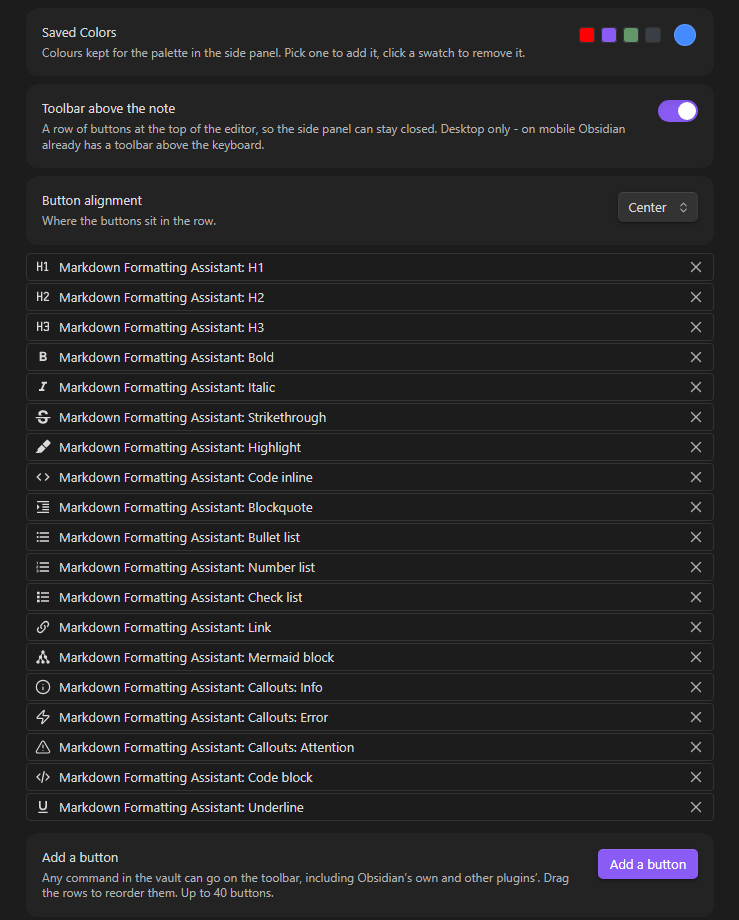

The bar appears only while you are editing, since every button writes to the note, and it wraps rather than scrolls, so a narrow pane costs a row of height instead of hiding half the buttons.

Desktop only. On mobile Obsidian already puts a toolbar above the keyboard, and a second one would only be in the way.

> The toolbar is inserted into the editor's own container, because Obsidian publishes no place to put one. That is the first thing to check if a future Obsidian release moves it or loses it.

## Color Picker

### Picking a colour

`Select a Color` opens the colour picker. When you close it, the colour is used straight away — on the selection if there is one, at the cursor if not — and is also copied to the clipboard.

`Last used colors` holds the last 10 colours picked, until Obsidian is closed. `Save Color` keeps the current colour for good under `Saved Colors`, which can also be edited in the settings.

Click any swatch to use that colour again. Right-click a swatch to remove it, and drag saved colours to change their order.

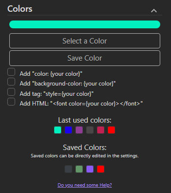

### Colouring selected text

Select some text and click a colour — recent, saved, or freshly picked — and the selection is wrapped so it takes that colour. One click, no options to tick first.

Ticking `background-color` gives you a background instead, in a `<span>`, since a `<font>` tag can only set the colour of the text.

### Inserting a colour code

With **nothing** selected, the checkboxes decide what the click writes at the cursor. They describe a piece of code to paste into a tag you are already writing, which is why they do not apply when there is a selection — there is only one thing "colour this text" can mean.

| Ticked | Written at the cursor |
| --- | --- |
| nothing | `#ff0000` |
| `color` | `color: #ff0000` |
| `background-color` | `background-color: #ff0000` |
| both | `color: #ff0000; background-color: #ff0000` |
| `style`, with either of the above | `style="background-color: #ff0000"` |
| HTML | `<font color="#ff0000"></font>`, whatever else is ticked |

## Languages

The interface is available in 12 languages: English, Беларуская, Deutsch, Español, Français, Italiano, 日本語, 한국어, Português, Русский, Українська and 简体中文.

By default the plugin follows the language Obsidian itself is set to. You can pick a specific one under `Settings → Markdown Formatting Assistant → Language`; it takes effect after Obsidian is restarted.

Only what you read is translated. The callout keyword inside `> [!note]` stays English, because that is what Obsidian matches on. The search windows match both the translated name and the original English one.

Translations other than English and Russian have not been reviewed by native speakers yet — corrections are very welcome. A language lives in a single file under `src/locales/`, and adding a new one means writing that file and adding one line to `src/locales/index.ts`.

## Keyboard and screen readers

`Tab` reaches every button in the side panel, `Enter` and `Space` press it, and the focused one is visibly outlined. Every button has a name, which a screen reader announces and which shows as a tooltip on hover — most of them hold a drawing rather than text, so without it there would be nothing to announce.

## Settings

- **Language** — default: same as Obsidian. Any of the 12 supported languages. Takes effect after a restart.
- **Side Pane Side** — default: right. Which sidebar the panel opens in.
- **Panel button alignment** — default: center. Left, center or right: where the buttons in the panel's sections sit, together with the swatches, the table picker and the links under each section. Takes effect at once.
- **Write callout headings** — default: on. Writes the callout's name as its heading, in your language. The keyword inside `[!note]` stays English either way.
- **Toggle *section* Section** — default: all on. Every section of the side panel can be switched off. Takes effect after a restart.
- **Toolbar above the note** — default: off. Which commands appear on it, in what order, and whether they sit left, centre or right. Desktop only.
- **Saved Colors** — the saved colours as swatches next to a colour picker. Pick a colour to add it, click a swatch to remove it. The order is the one the panel shows them in.

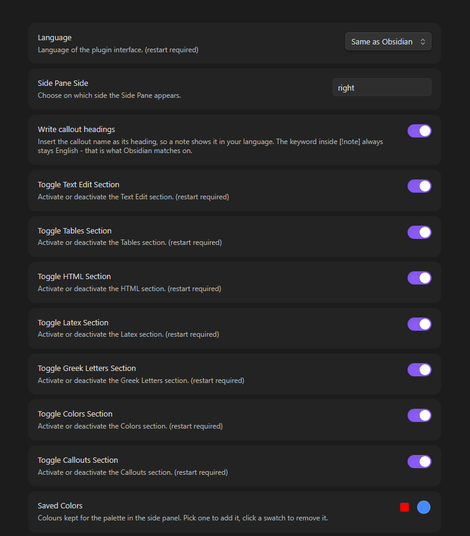

## Feedback

Found a bug, or missing a tag or an operator? Please [open an issue](https://github.com/Reocin/obsidian-markdown-formatting-assistant-plugin/issues). The panel links there too.

## Development

```
npm install
npm run build
```

The build lands in `build/` and contains everything Obsidian needs: `main.js`, `manifest.json` and `styles.css`. Copy them into `<vault>/.obsidian/plugins/obsidian-markdown-formatting-assistant-plugin/` to try it out.

```
npm test
npm run typecheck
```

The tests run on Node's own TypeScript support, so there is no test framework to install — Node 22.18 or newer is enough. They cover the text and cursor arithmetic, the list and quote markers, colour markup, the consistency of the twelve translation files, the stylesheet against the class names the code uses, the accessibility of the panel's buttons, and the links to this repository.

Run `npm run typecheck` as well as the build. Rollup reports a clean build for code that `tsc` rejects, so a green build on its own means very little here.

## Changelog

See [CHANGELOG.md](CHANGELOG.md).

## License

MIT. The plugin declared MIT in its `package.json` from its first commit but never shipped the licence text, so [LICENSE](LICENSE) states it explicitly and credits both authors.
